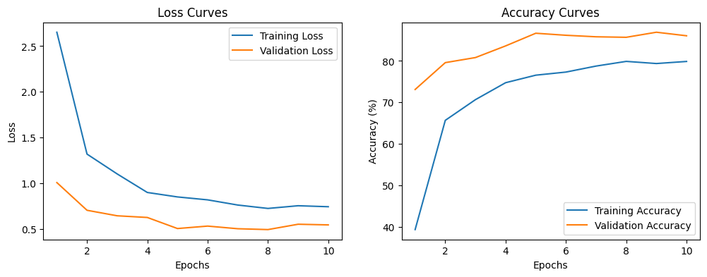
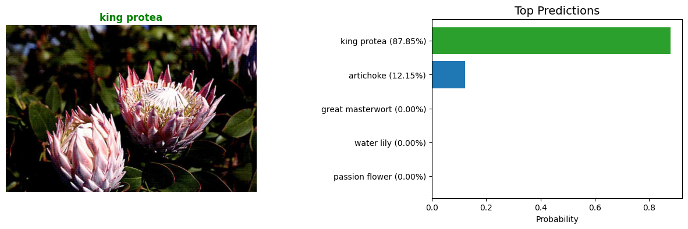

# Developing an Image Classifier

[](https://www.python.org/downloads/release/python-3127/)
[](https://pytorch.org/get-started/locally/)
[](LICENSE)

## Overview

An AI-powered image classifier that recognizes different species of flowers using deep learning. The model is trained with *transfer learning* on the **Oxford 102 Flowers** dataset, allowing it to predict flower species based on images. The project consists of two parts:

1. **Jupyter Notebook** – Train, evaluate, and test the model interactively.
2. **Command-Line Interface (CLI)** – A script for predicting flower species directly from the terminal.

The classifier is built using **PyTorch** and leverages a pre-trained convolutional neural network (CNN), by default **VGG16**, for transfer learning.

## Installation

### Prerequisites

Ensure you have the following installed:

- Python (>=3.12)
- pip

### Steps

1. Clone the repository:

    ```sh
    git clone https://github.com/sdtrklse/developing-an-image-classifier.git
    cd developing-an-image-classifier
    ```

2. Create and activate a virtual environment:

    ```sh
    python -m venv demo  # `python3 -m venv demo` on some systems
    source demo/Scripts/activate  # `source demo/bin/activate` on some systems
    ```

3. Install dependencies:

    ```sh
    pip install -r requirements.txt
    ```

## Project Structure

This project follows a structured directory layout for better organization and maintainability.

Below is the folder hierarchy:

```sh
project_root/
│── assets/               # Images, diagrams, icons, and other media
│── data/                 # Dataset storage
│── notebooks/            # Jupyter notebooks for training and evaluation
│── src/                  # Source code for the project
│── .gitignore            # Files to ignore in version control
│── LICENSE               # License for project usage
│── README.md             # Project documentation
└── requirements.txt      # Python dependencies
```

## Dataset

The project uses the [**Oxford 102 Flowers**](http://www.robots.ox.ac.uk/~vgg/data/flowers/102/index.html) dataset. Example images:


## Model Architecture

The model uses *transfer learning* with a pre-trained CNN (e.g., VGG16) from `torchvision` as the feature extractor and a custom feedforward network as the classifier. The classifier layers are fine-tuned for flower classification and have the following architecture:

- **Feature Extractor**: Pre-trained *VGG16* model (pre-trained on ImageNet)
- **Custom Classifier**:
    - Fully-connected layers
    - ReLU activation
    - Softmax output (102 Classes)
- **Frameworks/Libraries:** PyTorch, torchvision, Pillow, argparse, NumPy, Matplotlib

## Usage

### Notebook Version

1. Open the Jupyter notebook
2. Run all cells to train and evaluate the model
3. Test the model with new input images

### CLI Version

#### Train the model and save a checkpoint

Train a new network on a dataset with `train.py` that prints out training loss, training accuracy, validation loss, and validation accuracy as the network trains.

##### Basic usage for training

```sh
python train.py ../data/flowers --gpu
```

from the command line inside the `src` directory. The script will then train the model and save a checkpoint file.

##### Options for training

- Choose architecture

    ```sh
    python train.py /path/to/data --arch model_architecture
    ```

- Set hyperparameters

    ```sh
    python train.py /path/to/data --learning_rate learning_rate --epochs number_of_epochs
    ```

- Use GPU for training

    ```sh
    python train.py /path/to/data --gpu
    ```

- To get help on the command-line options, you can run:

    ```sh
    python train.py --help
    ```

#### Run inference on new data

Predict flower name from an image with `predict.py` along with the probability of that name. That is, you'll pass in a single image `/path/to/image` and return the flower name and class probability.

##### Basic usage for prediction

```sh
python predict.py ../assets/image-05761.jpg checkpoint.pth
```

from the command line inside the `src` directory. The script will then load the checkpoint and predict the flower species for the given image.

##### Options for prediction

- Return top-k most likely classes

    ```sh
    python predict.py /path/to/image /path/to/checkpoint --top_k number_of_classes
    ```

- Use a mapping of categories to real names

    ```sh
    python predict.py /path/to/image /path/to/checkpoint --category_names /path/to/file
    ```

- Use GPU for inference

    ```sh
    python predict.py /path/to/image /path/to/checkpoint --gpu
    ```

- To get help on the command-line options, you can run:

    ```sh
    python predict.py --help
    ```

## Performance Metrics

The loss and accuracy curves provide insights into the model's performance during training and evaluation.



## Example Results

The model successfully predicts flower species with high confidence, displaying the top predicted classes along with their probabilities.



## Future Improvements

There are possible enhancements to improve the model's performance and usability. Here are some ideas:

- Improve model accuracy with better tuning
- Deploy as a web app (Flask, FastAPI, Streamlit)
- Convert to mobile app (TensorFlow Lite, PyTorch Mobile)
- Optimize for speed (pruning, quantization)

## License

This project is licensed under the MIT License - see the [**LICENSE**](LICENSE) file for details.
